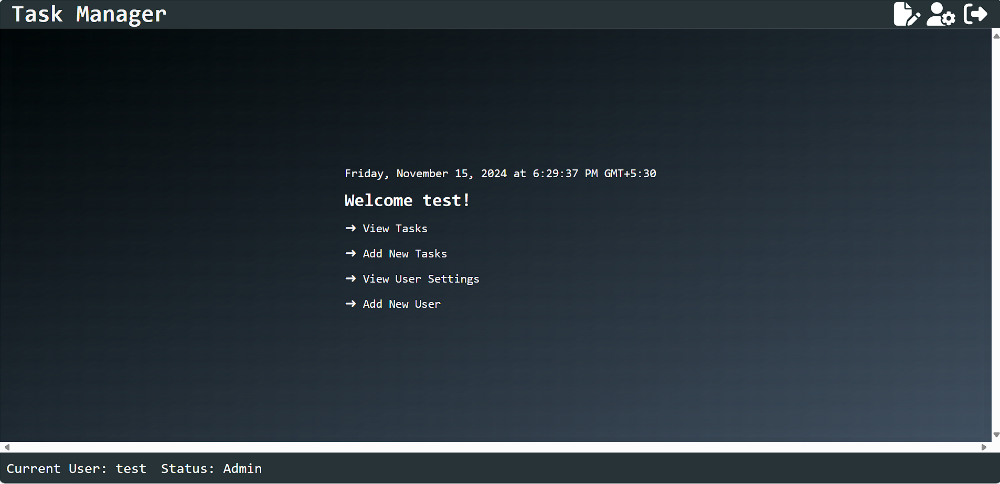
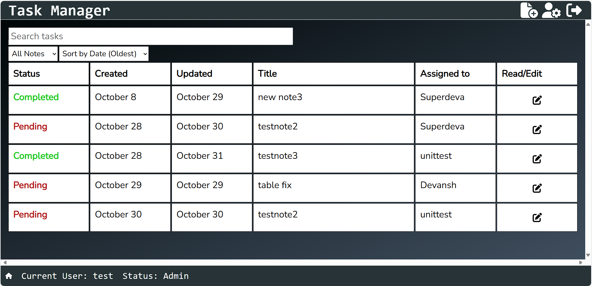
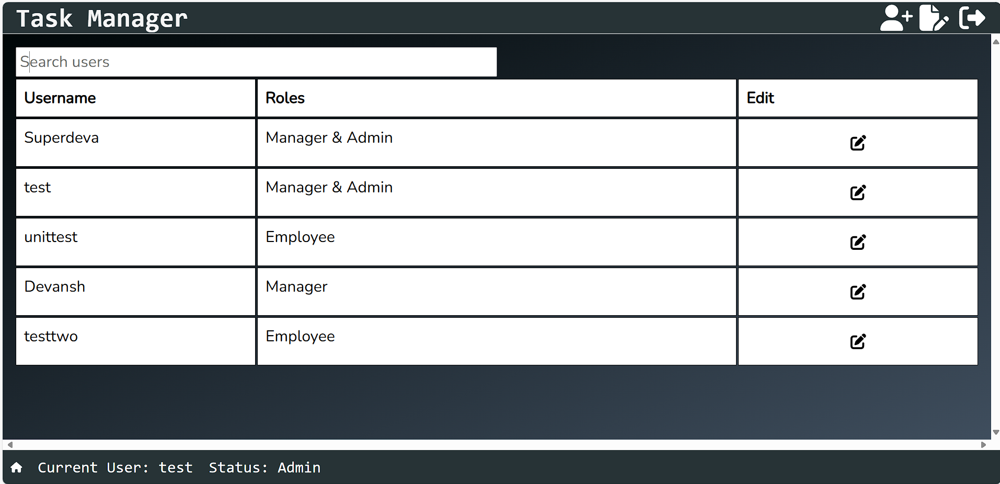
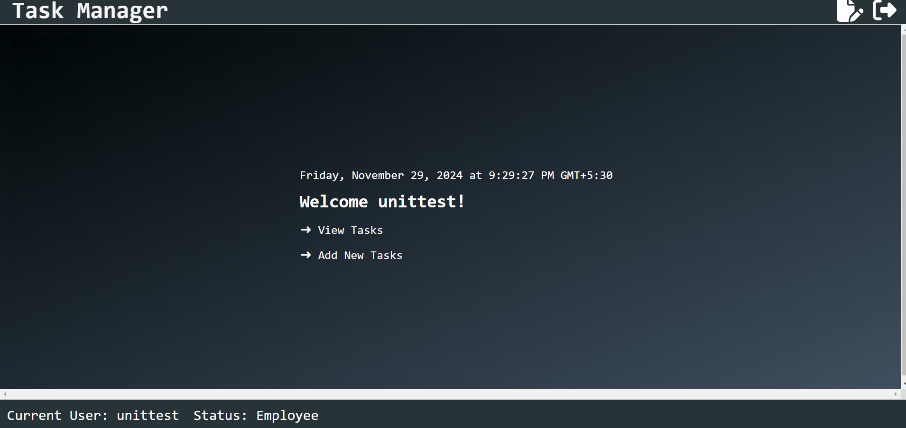

# 📝 Task Manager  
**Deployed Application**: [Click Here](https://task-manager-6wbc.onrender.com)

---

## 🌟 Project Overview  
This project is a **full-stack web application** designed to manage user authentication and note-taking functionalities. Built with modern web technologies, it offers a seamless user experience, secure authentication, and efficient state management.

---

## 🖥️ Frontend  
### **Tech Stack**  
- **Framework**: React  
- **State Management**: Redux Toolkit  
- **API Integration**: RTK Query for data fetching and caching  
- **Styling**: CSS  

### **Key Features**  
#### User Authentication  
- **Login**: Users can log in with credentials, and the system ensures secure authentication with error handling for invalid attempts.  
- **State Management**: Redux securely manages the authentication state, making it accessible throughout the app.  
- **API Integration**: The frontend communicates with the backend for login requests and session management.  

#### Note Management  
- **CRUD Operations**: Create, Read, Update, and Delete notes. Notes are private and securely linked to user accounts.  
- **User Interface**: Intuitive forms for creating/editing notes and a list view for displaying notes.  

---

## 🛠️ Backend  
### **Tech Stack**  
- **Framework**: Node.js with Express  
- **Database**: MongoDB for data storage  
- **Authentication**: JWT (JSON Web Tokens)  
- **Logging**: Middleware for request and error logging  

### **Key Features**  
#### User Management  
- **Registration**: Secure account creation and storage of user data.  
- **Authentication**: Credentials verification with JWT token issuance for authenticated sessions.  

#### Note Management  
- **CRUD Operations**: Secure endpoints for managing notes, restricted to authenticated users.  

---

## 🔐 Middleware  
- **Error Handling**: Custom middleware for logging and handling errors.  
- **CORS**: Configured to allow frontend-backend communication.  
- **Rate Limiting**: Prevents brute-force attacks by limiting login attempts.  

---

## 🔑 Role-Based Access Control (RBAC)  
RBAC ensures security by restricting actions based on user roles.

### **Roles and Permissions**  
- **Admin**:  
  - Manage users and roles.  
  - Create/Delete notes.  
  - View all user activities.  
- **Manager**:  
  - View/Edit notes.  
  - Assign tasks.  
  - Manage user activities.  
- **Employee**:  
  - Create/View/Update their own notes.  

---

## 📸 Screenshots  
  
  
  
  
---

## ⚙️ Running the Project Locally  
1. Clone the repository.  
2. Update the following configurations:  
   - **Backend**: Change CORS `allowed origin` in `config/backend` to `http://localhost:3500`.  
   - **Frontend**: Update `baseURL` in `api/app/frontend` to `http://localhost:3000`.  

### **Commands**  
- **Backend**: `npm run dev`  
- **Frontend**: `npm start`  

---

## 🎯 Features at a Glance  
- **Authentication**: Login, Registration, JWT Authentication.  
- **Note Management**: Full CRUD operations with user-specific notes.  
- **Role-Based Access Control**: Admin, Manager, and Employee roles with distinct permissions.  
- **Security**: Rate limiting, CORS, and error handling middleware.  

---

💡 *Contributions and suggestions are always welcome!*  
